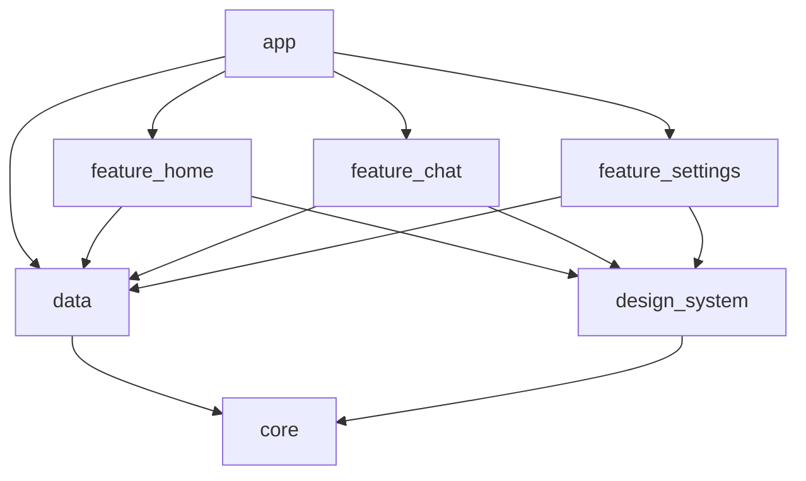

# Mobile System Design Practice Guide for Experienced Android Developers

This guide is designed for Android developers with 3+ years of experience, focusing on practical HLD and LLD problems relevant to modern mobile application development. It emphasizes the thought process required to tackle these problems in an interview setting.

## Core Philosophy: The "Why" Before the "How"

In any system design interview, the most critical part is not just listing technologies but explaining *why* you're choosing them. Your reasoning demonstrates your understanding of trade-offs, scalability, and performance. Always start by clarifying requirements and constraints.

**Key Questions to Ask Your Interviewer:**

*   **Functional Requirements:** What should the app *do*? (e.g., "Users can view a feed of photos," "Users can save articles for offline reading.")
*   **Non-Functional Requirements (NFRs):** What are the constraints and quality attributes?
    *   **Scalability:** How many users are we expecting? (1k, 1M, 100M?)
    *   **Performance:** How fast should the app feel? (e.g., "Feed should load in under 2 seconds.")
    *   **Offline Support:** Should the app work without an internet connection? To what extent?
    *   **Consistency:** How critical is it for all users to see the same data at the same time?
    *   **Battery/Data Usage:** Are there strict limits on resource consumption?
    *   **Security:** What are the security considerations? (e.g., user data, authentication).

---

## Section 1: High-Level Design (HLD) for Mobile

HLD for mobile is about the big picture: how your app interacts with the network, how it stores data, and how it handles major features from an architectural standpoint.

### HLD Framework: A Step-by-Step Approach

1.  **Clarify Requirements & Constraints:** Use the questions above.
2.  **API Design & Communication:** How does the app talk to the backend?
3.  **Data Management:** How is data fetched, stored, and synchronized?
4.  **Offline Strategy:** Design for no-connectivity scenarios.
5.  **Scalability & Performance:** Identify potential bottlenecks.
6.  **Diagramming:** Draw a high-level component diagram.

---

### HLD Example 1: Design an Offline-First News Feed App

**1. Requirements Clarification:**

*   **Functional:**
    *   Users see a scrollable feed of news articles.
    *   Users can tap an article to read it in full.
    *   Users can "bookmark" articles to read later.
    *   The feed should update automatically.
*   **Non-Functional:**
    *   **Offline First:** The app must be fully functional offline. Users should be able to read already-loaded articles and their bookmarks.
    *   **Performance:** The feed should scroll smoothly. Article details should load instantly.
    *   **Data Usage:** Be mindful of data consumption. Don't download a gigabyte of news.
    *   **Consistency:** Eventual consistency is acceptable. It's okay if a user sees a slightly outdated feed for a few minutes.

**2. API Design & Communication Strategy:**

*   **Backend Interaction:** We'll use a REST API over HTTPS.
*   **Endpoints:**
    *   `GET /v1/feed?page=<token>&limit=20`: Fetches a paginated list of article summaries. Using a cursor/token-based pagination is better for real-time feeds than offset-based.
    *   `GET /v1/articles/<article-id>`: Fetches the full content of an article.
    *   `POST /v1/bookmarks`: Adds an article to bookmarks.
    *   `DELETE /v1/bookmarks/<article-id>`: Removes a bookmark.
*   **Data Format:** JSON. It's lightweight and universally supported.
*   **Server-Driven UI (SDUI) Thought Process:**
    *   **Question to ask myself:** "Could the UI for a feed item change frequently? For instance, for promotions or different article types (video, text, gallery)."
    *   **Answer:** Yes. To avoid frequent app releases for simple UI tweaks, we can use SDUI for the feed items. The `/feed` endpoint response would include not just data but also UI component identifiers.
    *   **JSON Response (with SDUI):**
        ```json
        {
          "items": [
            {
              "type": "story_card",
              "data": { "id": "123", "title": "...", "summary": "...", "imageUrl": "..." }
            },
            {
              "type": "video_card",
              "data": { "id": "456", "title": "...", "thumbnailUrl": "...", "videoUrl": "..." }
            }
          ],
          "nextPageToken": "some_opaque_token"
        }
        ```
    *   The app would have pre-built Jetpack Compose components for `story_card`, `video_card`, etc., and would render the feed dynamically based on the `type`.

**3. Data Management (The Core of Offline-First):**

This is where the "Single Source of Truth" (SSOT) principle is crucial. The database is the SSOT, not the network.

*   **Database:** `Room` is the standard choice. It's an abstraction over SQLite that integrates well with Kotlin and Coroutines/Flow.
*   **Tables:**
    *   `articles` (`id`, `title`, `summary`, `content`, `imageUrl`, `is_bookmarked`)
    *   `remote_keys` (for managing pagination state)
*   **Data Flow:**
    1.  **UI:** The `ViewModel` exposes a `Flow<List<Article>>` directly from the `Room` database. The UI (using Jetpack Compose) collects this Flow and is always displaying data from the database.
    2.  **Repository:** The `ViewModel` requests data from a `Repository`.
    3.  **Network Request:** The `Repository` triggers a network request to the `/feed` endpoint.
    4.  **Database Update:** On a successful response, the `Repository` **does not** return the data directly. Instead, it **saves the fresh data into the `Room` database**.
    5.  **UI Update:** `Room`'s `Flow` automatically emits the new list of articles, and the UI updates reactively.

*   **Diagram of Data Flow:**
    `UI <--- ViewModel <--- Repository <--- (Room DB <---> Network API)`

**4. Offline Strategy:**

*   **Reading:** Because the UI reads from the database (SSOT), reading already-fetched articles and bookmarks "just works" offline.
*   **Writing (Bookmarking):**
    1.  When a user bookmarks an article offline, we immediately update the `is_bookmarked` flag in the local `Room` database. The UI reflects this change instantly.
    2.  We need to sync this change back to the server when connectivity resumes. A simple way is to have a "dirty" flag (`is_sync_pending`) in the `articles` table.
    3.  A more robust solution is a separate `sync_queue` table (`action`, `payload`, `timestamp`). This is more scalable for handling different types of offline actions.
    4.  **Syncing Mechanism:** Use `WorkManager` to schedule a background job that checks for pending sync operations and sends them to the backend. `WorkManager` is perfect for this because it respects battery optimizations and can be constrained to run only when the network is available.

---

## Section 2: Low-Level Design (LLD) for Mobile

LLD is about how you build the components discussed in HLD. It's about clean architecture, class design, and writing maintainable, testable code.

### LLD Framework: A Step-by-Step Approach

1.  **Define Responsibilities:** What is the specific responsibility of the feature/component you are designing?
2.  **Choose the Right Architecture:** MVVM is a great default. Justify it (testability, separation of concerns).
3.  **Component & Class Design:** Define the `ViewModel`, `Repository`, `DataSource` interfaces and classes.
4.  **Data Models:** Define your data classes (e.g., for Room entities, API responses).
5.  **Threading & Concurrency:** How will you handle background work? (Coroutines, Flow).
6.  **Dependency Injection:** How will you provide dependencies? (Hilt, Koin).
7.  **Testing Strategy:** How will you unit test each layer?

---

### LLD Example: Design an Image Loading Library

Let's say the interviewer asks: "You need to display images from URLs in your app. Instead of using Picasso or Glide, design your own image loading library."

**1. Define Responsibilities & Clarify Requirements:**

*   Load an image from a URL into an `ImageView` (or a Compose `Image`).
*   Placeholder support: Show a drawable while the image is loading.
*   Error support: Show a drawable if loading fails.
*   **Caching:** This is the most important part. We need an efficient caching strategy.
    *   **Memory Cache:** For instant access to recently seen images.
    *   **Disk Cache:** For persisting images across app sessions.
*   **Request Handling:** Avoid re-fetching the same URL if a request is already in-flight.

**2. Architecture & Component Design:**

*   **Facade Pattern:** We'll have a single entry point, e.g., `ImageLoader.load(...)`. This simplifies the API for the consumer.
*   **Chain of Responsibility Pattern for Caching:**
    1.  Request comes into `ImageLoader`.
    2.  Check **Memory Cache**. If found, return the bitmap.
    3.  If not, check **Disk Cache**. If found, decode it, put it in the memory cache, and return it.
    4.  If not, go to the **Network**. If successful, save the image to both disk and memory caches, then return it.

**3. Class Design & Implementation Details:**

*   `ImageLoader`: The public-facing class. It manages the request lifecycle.
    ```kotlin
    class ImageLoader(
        private val memoryCache: ImageCache,
        private val diskCache: ImageCache,
        private val networkLoader: NetworkLoader
    ) {
        // Coroutine scope for managing image loading jobs
        private val scope = CoroutineScope(Dispatchers.IO)

        fun load(url: String, target: ImageView) {
            scope.launch {
                val bitmap = memoryCache.get(url) ?: diskCache.get(url) ?: networkLoader.load(url)
                bitmap?.let {
                    diskCache.put(url, it) // Ensure it's in both caches
                    memoryCache.put(url, it)
                    withContext(Dispatchers.Main) {
                        target.setImageBitmap(it)
                    }
                }
            }
        }
    }
    ```
*   `ImageCache` (Interface):
    ```kotlin
    interface ImageCache {
        fun get(key: String): Bitmap?
        fun put(key: String, bitmap: Bitmap)
    }
    ```
*   `MemoryCache` (Implementation):
    *   **Data Structure:** Use an `LruCache`. It's perfect for this as it automatically evicts the least recently used items when the cache size limit is reached.
    *   **Sizing:** The size should be a fraction of the app's available memory, e.g., `(Runtime.getRuntime().maxMemory() / 1024) / 8`.
*   `DiskCache` (Implementation):
    *   **Library:** Use `DiskLruCache` from Jake Wharton. It's a robust, well-tested implementation.
    *   **Location:** Store it in the app's `cacheDir`. This allows the OS to clear it if space is needed.
    *   **Keys:** Don't use raw URLs as keys because they can contain special characters. Use a hash of the URL (e.g., MD5 or SHA-256).
*   `NetworkLoader`: A simple class that uses `OkHttp` or a standard `HttpURLConnection` to fetch the image bytes from the URL and decode them into a `Bitmap`.

**4. Threading & Concurrency:**

*   **Kotlin Coroutines:** The entire process should be off the main thread.
*   `withContext(Dispatchers.IO)` for all disk and network operations.
*   `withContext(Dispatchers.Main)` to set the final bitmap on the `ImageView`.
*   **Request Deduplication:** How to handle two quick calls to `load()` with the same URL?
    *   Maintain a `Map<String, Job>` of in-flight requests.
    *   When `load()` is called, check if a `Job` for that URL already exists in the map.
    *   If yes, `join()` the existing job instead of starting a new one.
    *   If no, create a new `Job`, put it in the map, and start the loading process. Remove it from the map when done.

**5. Dependency Injection:**

*   Use **Hilt** to provide the `MemoryCache`, `DiskCache`, and `NetworkLoader` instances to the `ImageLoader`. This makes the `ImageLoader` highly testable. You can easily provide mock caches or a mock network loader in your unit tests.

By breaking down the problem this way, you demonstrate a deep understanding of caching strategies, concurrency, and clean API design—all critical skills for an experienced Android engineer.

---
---

### HLD Example 2: Design a 1-on-1 Chat Application (e.g., WhatsApp/Signal)

This problem tests real-time communication, state management, and offline capabilities.

**1. Requirements Clarification:**

*   **Functional:**
    *   Users can see a list of their chats.
    *   Users can open a chat to see the message history.
    *   Users can send and receive text messages in real-time.
    *   Show message status: Sent, Delivered, Read.
    *   Show user presence: Online, Offline, and "is typing..." indicator.
*   **Non-Functional:**
    *   **Real-time:** Messages should appear almost instantly.
    *   **Reliable Delivery:** Messages must not be lost and should be delivered in order.
    *   **Low Battery/Data Usage:** The connection should be efficient.
    *   **Offline Support:** Users should be able to read old messages and send new ones even when offline (they will be sent upon reconnection).

**2. API Design & Communication Strategy:**

A simple REST API isn't suitable for real-time features. This is the core of the problem.

*   **Hybrid Approach:**
    *   **REST API (HTTPS):** For one-off actions like fetching chat history, user profiles, or creating a new chat.
        *   `GET /chats`: Get the list of all chat conversations for the user.
        *   `GET /messages?chatId=<id>&before=<timestamp>&limit=50`: Get the message history for a chat, with pagination.
    *   **WebSockets:** For all real-time bidirectional communication. A persistent WebSocket connection is far more efficient for chat than long-polling.
        *   The client establishes a single WebSocket connection after login.
        *   This connection is used to send messages, receive messages, and handle all status updates (delivered, read, typing).

*   **WebSocket Events (Data Format: JSON):**

    *   **Client to Server:**
        *   **Send Message:** `{ "event": "send_message", "payload": { "chatId": "...", "text": "Hello!", "localId": "local-uuid-123" } }`
            *   Note the `localId`: The client creates a temporary ID so it can match the server's confirmation later.
        *   **Mark as Read:** `{ "event": "mark_read", "payload": { "chatId": "...", "lastMessageId": "..." } }`

    *   **Server to Client:**
        *   **New Message:** `{ "event": "new_message", "payload": { "messageId": "server-id-456", "localId": "local-uuid-123", "chatId": "...", "senderId": "...", "text": "Hello!", "timestamp": ... } }`
            *   The server sends back the `localId` so the client can update the status of the correct message from "sending" to "sent".
        *   **Status Update:** `{ "event": "status_update", "payload": { "messageId": "...", "status": "delivered" } }`
        *   **Presence Update:** `{ "event": "presence_update", "payload": { "userId": "...", "status": "typing" } }`

**3. Data Management (SSOT is Key):**

*   **Database:** `Room` is the Single Source of Truth.
*   **Tables:**
    *   `messages` (`id` (Primary Key), `serverId`, `chatId`, `senderId`, `text`, `timestamp`, `status` ['sending', 'sent', 'delivered', 'read'])
    *   `chats` (`id`, `participantName`, `participantAvatarUrl`, `lastMessageText`, `unreadCount`)
*   **Data Flow for Sending a Message:**
    1.  User hits "send".
    2.  **Instantly** write the message to the `Room` database with `status = 'sending'`. Use a temporary local UUID for the `id`.
    3.  The UI, observing a `Flow` from `Room`, immediately shows the message with a "sending" icon (e.g., a clock).
    4.  Send the message over the WebSocket (including the local ID).
    5.  When the server's `new_message` event comes back with the matching `localId`, update the local message in `Room`: replace the local ID with the `serverId`, and update `status = 'sent'`. The UI updates reactively.

**4. Offline & Reliability Strategy:**

*   **Reading:** Works by default because the UI reads from the database.
*   **Sending:**
    1.  If the WebSocket is disconnected when the user tries to send, the message is still saved to `Room` with `status = 'sending'`.
    2.  We need a **Sync/Outbox Manager**. This component's job is to:
        *   Observe the `messages` table for items with `status = 'sending'`.
        *   Observe the network/WebSocket connection state.
        *   When the connection is re-established, it sends all pending messages from the Outbox. This can be implemented reliably using `WorkManager`.
*   **Message Ordering:** Timestamps are not enough due to clock skew. The server must be the source of truth for message order. The client should insert messages based on a sequence number or a reliable timestamp provided by the server.

**5. Scalability & Efficiency:**

*   **Presence (Typing Indicators):** This can create a storm of events.
    *   **Debounce/Throttle:** Don't send a "typing" event on every keystroke. Send one when the user starts typing. If the user stops for >2 seconds, send a "stopped_typing" event.
*   **Connection Management:** The mobile client should have robust logic to handle WebSocket disconnects (e.g., when switching from Wi-Fi to Cellular). Use an exponential backoff strategy for reconnection attempts to avoid spamming the server.

---

### LLD Example 2: Design a Robust Networking Layer

This task is about abstracting network operations to make them reusable, testable, and robust.

**1. Define Responsibilities & Requirements:**

*   Abstract the specific networking library (e.g., Retrofit, Ktor). The rest of the app shouldn't know or care what library is being used.
*   Provide a unified response wrapper for UI states: `Loading`, `Success`, `Error`.
*   Automate adding authentication tokens to requests.
*   Gracefully handle auth token expiration and renewal (e.g., 401 Unauthorized errors).
*   Centralize error handling.

**2. Choose the Right Architecture & Components:**

*   **Layers:** `ViewModel -> Repository -> RemoteDataSource -> ApiService (Retrofit Interface)`
*   **Generic `Resource` Sealed Class:** This is the cornerstone for communicating state to the UI.
    ```kotlin
    sealed class Resource<T>(val data: T? = null, val error: Throwable? = null) {
        class Success<T>(data: T) : Resource<T>(data)
        class Loading<T>(data: T? = null) : Resource<T>(data) // Can hold old data while loading new
        class Error<T>(error: Throwable, data: T? = null) : Resource<T>(data, error)
    }
    ```
*   **Dependency Injection (Hilt):** Essential for providing `OkHttpClient`, `Retrofit`, and `ApiService` instances.

**3. Component & Class Design:**

*   **`AuthInterceptor` (OkHttp Interceptor):**
    *   Its job is to intercept every outgoing request.
    *   It retrieves the auth token from a secure source (e.g., `EncryptedSharedPreferences`).
    *   It adds the token to the `Authorization` header.
    *   This completely decouples token management from the `Repository` or `ViewModel`.
    ```kotlin
    class AuthInterceptor(private val tokenManager: TokenManager) : Interceptor {
        override fun intercept(chain: Interceptor.Chain): Response {
            val token = tokenManager.getAuthToken()
            val request = chain.request().newBuilder()
            request.addHeader("Authorization", "Bearer $token")
            return chain.proceed(request.build())
        }
    }
    ```

*   **`TokenAuthenticator` (OkHttp Authenticator):**
    *   This is a special OkHttp mechanism that's **only triggered on a 401 Unauthorized response**.
    *   Its job is to try and refresh the token and then retry the original request.
    *   It must be `synchronized` to prevent multiple failed requests from all trying to refresh the token at once.
    ```kotlin
    class TokenAuthenticator(private val tokenManager: TokenManager) : Authenticator {
        override fun authenticate(route: Route?, response: Response): Request? {
            // Check if we've already tried to refresh and failed
            if (response.request.header("Authorization") != null) {
                return null // Give up
            }

            synchronized(this) {
                val newAccessToken = tokenManager.refreshToken() // This would be a blocking call
                if (newAccessToken.isNotBlank()) {
                    // Retry the original request with the new token
                    return response.request.newBuilder()
                        .header("Authorization", "Bearer $newAccessToken")
                        .build()
                }
            }
            return null
        }
    }
    ```
*   **Hilt Module for Networking:**
    ```kotlin
    @Module
    @InstallIn(SingletonComponent::class)
    object NetworkModule {
        @Provides @Singleton
        fun provideOkHttpClient(authInterceptor: AuthInterceptor, tokenAuthenticator: TokenAuthenticator): OkHttpClient {
            return OkHttpClient.Builder()
                .addInterceptor(authInterceptor)
                .authenticator(tokenAuthenticator)
                .build()
        }

        @Provides @Singleton
        fun provideRetrofit(okHttpClient: OkHttpClient): Retrofit {
            return Retrofit.Builder()
                .baseUrl("https://api.example.com/")
                .client(okHttpClient)
                .addConverterFactory(GsonConverterFactory.create())
                .build()
        }
    }
    ```

*   **`BaseRepository` (Optional but helpful):**
    *   You can create a base class with a helper function to wrap calls in the `Resource` class and handle exceptions.
    ```kotlin
    abstract class BaseRepository {
        protected fun <T> safeApiCall(apiCall: suspend () -> T): Flow<Resource<T>> = flow {
            emit(Resource.Loading())
            try {
                emit(Resource.Success(apiCall()))
            } catch (e: Throwable) {
                emit(Resource.Error(e))
            }
        }.flowOn(Dispatchers.IO)
    }
    ```

**4. Testing Strategy:**

*   This architecture is highly testable.
*   **`AuthInterceptor`:** Can be unit tested by checking if the header is added correctly.
*   **`Repository`:** Use a `MockWebServer` to simulate API responses (success, 401, 500, etc.) and assert that the repository emits the correct `Resource` states.
*   **`ViewModel`:** Provide a fake `Repository` to the `ViewModel` and test how it translates `Resource` states into UI states.

---
---

### HLD Example 3: Design a Real-Time Bus Tracking App (like Chalo)

This problem tests your ability to handle high-frequency real-time data from multiple sources (buses) and distribute it efficiently to many clients (users).

**1. Requirements Clarification:**

*   **Functional:**
    *   Users can see nearby bus stops on a map.
    *   Users can select a stop to see all buses arriving there and their ETAs.
    *   Users can select a bus to see its real-time location on the map.
    *   Users can search for routes between two locations.
    *   (Premium Feature) Users can buy bus passes/tickets in the app.
*   **Non-Functional:**
    *   **Real-Time:** Bus locations on the map must be updated frequently (e.g., every 5-10 seconds).
    *   **Accuracy:** ETAs must be as accurate as possible, accounting for traffic.
    *   **Scalability:** The system must support thousands of buses and millions of users concurrently.
    *   **Battery Efficiency:** The user's app should not drain the battery while actively tracking a bus. The GPS device on the bus must also be efficient.
    *   **Offline Support:** Users should be able to see static route information and their purchased tickets even when offline.

**2. High-Level Architecture Diagram:**

This system has three main components: the bus hardware, the backend, and the user's app.

`[GPS Device on Bus] ---> [Backend Server] <---> [User's Mobile App]`

**3. Deep Dive: Components & Communication Protocols**

*   **Bus-to-Backend Communication:**
    *   **Problem:** Sending a new HTTP request every 5 seconds from thousands of buses would overwhelm the server. HTTP is too heavyweight for this kind of IoT data stream.
    *   **Solution:** Use a more lightweight and persistent protocol.
        *   **MQTT:** The ideal choice. It's a publish/subscribe protocol designed for IoT devices with low bandwidth and high latency. The bus device publishes its location (`{busId, lat, lon, timestamp}`) to a specific topic (e.g., `/locations/bus/123`).
        *   **WebSocket:** A viable alternative. The bus maintains a persistent connection and sends location data as messages. More resource-intensive than MQTT but simpler to implement with standard web technologies.
*   **Backend Services:**
    *   **Location Ingestion Service:** An MQTT broker or WebSocket gateway that receives raw GPS data. It cleans/validates the data and pushes it into a high-throughput message queue like **Kafka** or **RabbitMQ**.
    *   **Message Queue (Kafka):** Acts as a buffer and allows multiple services to consume the location data independently.
    *   **Real-time Processor (e.g., Apache Flink/Spark Streaming):** Consumes from Kafka. Its job is to update the bus's "last known location" in a cache.
    *   **ETA Calculation Service:** A complex service that also consumes from Kafka. It combines the real-time location with historical speed data and real-time traffic data (from a provider like Google Maps API) to constantly recalculate ETAs for all stops.
    *   **Cache (Redis):** Crucial for performance. Stores the last known location of every bus and the calculated ETAs for every stop. Redis has excellent geospatial query support.
    *   **Database (PostgreSQL with PostGIS):** The persistent source of truth for static data like bus routes, stop locations, and user accounts/tickets.
    *   **API Gateway & Websocket Service:** The entry point for the user's app.
*   **Backend-to-User Communication:**
    *   **Problem:** How does the user get real-time updates without polling?
    *   **Solution:** WebSockets.
        1.  When a user opens the app and looks at a map region, the app makes a REST call to `GET /buses_in_region?bounds=...` to get the initial locations of all buses in view.
        2.  When a user taps on a *specific* bus to track it, the app opens a WebSocket connection and subscribes to updates for that bus: `{ "action": "subscribe", "busId": "123" }`.
        3.  The backend's WebSocket service, upon receiving this, will now push location updates for bus `123` (retrieved from the Redis cache) to that specific client every few seconds. This is far more efficient than the client polling.

**4. Mobile Client Design Considerations:**

*   **Map Performance:**
    *   **Marker Clustering:** When zoomed out, you can't render thousands of individual bus markers. It will crash the app. Use a map clustering library to group nearby markers into a single cluster icon (e.g., "10+"). The markers resolve into individual icons as the user zooms in.
*   **Battery Life:**
    *   When the user is tracking a bus, the app has an open WebSocket and is updating the UI. This uses battery. Be transparent about this.
    *   When the app is in the background, it should close the WebSocket connection to conserve battery, unless providing a persistent notification for an upcoming stop. This background work should be managed by a foreground service to prevent the OS from killing it.
*   **Offline Support:**
    *   Cache all static route and stop data in a local `Room` database.
    *   Digital tickets must be stored securely on the device so they can be shown without a network connection.

---

### HLD Example 4: Design a Healthcare App (like Even Healthcare)

For this problem, functional requirements are secondary to the non-functional requirement of **Security and Privacy**. Your answer must be built on a foundation of security first.

**1. Requirements Clarification:**

*   **Functional:**
    *   Patients can register, create a profile, and upload their medical history.
    *   Patients can search for doctors and schedule consultations (video or text).
    *   Patients can view their medical records, prescriptions, and lab results.
    *   Doctors have a separate portal to manage their patients and schedule.
*   **Non-Functional (The MOST important part):**
    *   **SECURITY & COMPLIANCE:** Must be compliant with regulations like **HIPAA** (in the US). This is non-negotiable and dictates the entire design.
    *   **Data Privacy:** All Personally Identifiable Information (PII) and Protected Health Information (PHI) must be protected.
    *   **Data Integrity:** Medical records cannot be altered or lost. All changes must be auditable.
    *   **Availability:** The system must be highly reliable, especially for consultations.

**2. Architecture: A Zero-Trust, Security-First Approach**

*   **Encryption is Mandatory Everywhere:**
    *   **In Transit:** All communication must use **TLS 1.2+**. No unencrypted HTTP.
    *   **At Rest:** All databases, object storage, and backups must be encrypted.
    *   **On Client:** Any sensitive data stored on the mobile device must be in an encrypted database (`SQLCipher` for Room) or `EncryptedSharedPreferences`.
*   **Authentication & Authorization:**
    *   **Multi-Factor Authentication (MFA):** Mandatory for all users, especially doctors.
    *   **Role-Based Access Control (RBAC):** Access must be granular and strictly enforced at the API Gateway. A doctor can *only* access records for patients explicitly assigned to them. A patient can *only* see their own data.
    *   **Short-lived Credentials:** Auth tokens should have short expiry times.
*   **Auditing:** Every single access to PHI (a doctor viewing a record, a patient downloading a lab result) must be logged in a secure, immutable audit trail.

**3. Backend Components & Third-Party Choices**

You do not build security-sensitive services from scratch if you can avoid it. You use certified, compliant providers.

*   **API Gateway:** Enforces all auth and RBAC policies before a request can reach any other service.
*   **Identity Provider (e.g., Auth0, Okta):** Manages user login and MFA. They are experts in this.
*   **Video Consultation Service:** **Must be a HIPAA-compliant provider** like **Twilio Video** or **Vonage**. Do not use a generic WebRTC service. These providers have specific business associate agreements (BAAs) for handling PHI.
*   **Chat Service:** Also requires a HIPAA-compliant provider like **Sendbird** or **PubNub**. For maximum security, you'd implement **End-to-End Encryption (E2EE)** where the server only stores encrypted blobs of messages, and only the authenticated patient and doctor have the keys to decrypt them on their devices.
*   **Database & Storage:**
    *   Use a managed database service from a major cloud provider (AWS, GCP, Azure) that is HIPAA-eligible (e.g., AWS RDS).
    *   For medical records, the industry best practice is to use a **FHIR (Fast Healthcare Interoperability Resources) Server**. This is a specialized data format and API standard for exchanging healthcare information. It enforces the correct structure for medical data.
    *   File storage (e.g., for lab results) must also be in a HIPAA-eligible service like AWS S3, with object encryption enabled.

**4. Mobile Client Design Considerations:**

*   **Local Storage:** As mentioned, all local storage must be encrypted. Minimize the PHI you store on the device. Fetch it from the server when needed and cache it for short periods in encrypted storage.
*   **Client-Side Security Measures:**
    *   **Root/Jailbreak Detection:** The app should refuse to run on a compromised operating system.
    *   **Screenshot & Screen Recording Prevention:** Android allows you to programmatically block screenshots on screens displaying sensitive data.
    *   **Certificate Pinning:** Helps prevent man-in-the-middle (MITM) attacks by ensuring the app only talks to your legitimate server certificate.
    *   **Biometric Lock:** The app must be locked and require Face ID / Fingerprint to re-enter after a short timeout or when brought to the foreground.
    *   **Obfuscation:** Use code obfuscation tools like ProGuard/R8 to make it harder for attackers to reverse-engineer the app.

---
---

### LLD Example 3: Design a Scalable Multi-Module App Architecture

As an app grows, a single-module monolith becomes slow to build, hard to navigate, and difficult to maintain. Modularization is the solution. This is a very common LLD question that tests your understanding of building scalable and maintainable codebases.

**1. Define Responsibilities & Goals (The "Why"):**

First, justify the move to a multi-module architecture.

*   **Faster Build Times:** Gradle can build unmodified modules in parallel and cache their outputs. If you only change code in one feature module, you don't need to recompile the others. This is a massive productivity boost.
*   **Separation of Concerns:** Enforces a clean architecture. The `:data` layer *cannot* access the `:presentation` layer, preventing bad practices.
*   **Code Ownership:** Different teams can own different feature modules, reducing merge conflicts and increasing autonomy.
*   **Reusability:** Core functionalities can be reused across different apps (e.g., a `:design_system` module).
*   **Dynamic Delivery:** A modular architecture is a prerequisite for shipping features as on-demand Dynamic Feature Modules, reducing the initial app download size.

**2. The Module Structure: A Layered Approach**

The most common and effective structure is a layered one. The key rule is that **dependencies must flow inwards**. UI layers depend on domain/data layers, but data layers know nothing about the UI.

Here is a standard, scalable structure:

*   `:app`
    *   This is the final, installable APK/AAB module.
    *   Its main job is to pull together all the other modules.
    *   It contains the root `Application` class, the main `Activity`, and the top-level navigation graph. It should have very little actual code.

*   `:core` (or `:common`)
    *   Contains code needed by *many* other modules.
    *   Examples: Base `ViewModel` or `Repository` classes, utility functions, constants, dependency injection wiring for app-wide singletons, and core extension functions.
    *   It should have minimal dependencies on external libraries to avoid pulling them into every module that includes `:core`.

*   `:design_system`
    *   Contains all shared UI components for building a consistent user experience.
    *   Examples: `AppTheme`, custom `Button`, `TextField`, `Card` Composables, colors, typography, and dimensions.
    *   Depends on `:core` (for resources), but nothing else.

*   `:data`
    *   Responsible for all data operations. **It has no knowledge of the UI.**
    *   Contains `Repository` implementations, `Retrofit` API interfaces, `Room` database definitions and DAOs, and data models (DTOs and Entities).
    *   Depends on `:core` and networking/database libraries.

*   `:feature_xyz` (e.g., `:feature_home`, `:feature_chat`, `:feature_settings`)
    *   Each module is a self-contained feature or user flow.
    *   Contains all the UI for that feature (Composables, ViewModels, and feature-specific navigation graphs).
    *   The golden rule: **A feature module must NEVER depend directly on another feature module.**
    *   A feature module typically depends on `:data`, `:core`, and `:design_system`.

**3. Diagram of Dependencies:**

This visualizes the strict, one-way dependency rule.



**4. Solving Inter-Feature Navigation:**

If `:feature_home` cannot depend on `:feature_chat`, how does a button in the home screen navigate to the chat screen?

This is a classic modularity problem. The solution is to make navigation contracts abstract and have the `:app` module, which sees everything, fulfill those contracts.

*   **Using Jetpack Navigation:** This is the standard approach.
    1.  Each feature defines its own `NavGraph` in its own module. For example, `:feature_chat` has a `chat_nav_graph.xml`.
    2.  The `:app` module defines a main `app_nav_graph.xml`.
    3.  The `:app` graph then uses the `<include>` tag to import the feature-level graphs.
        ```xml
        <!-- in :app's nav graph -->
        <include app:graph="@navigation/chat_nav_graph" />
        ```
    4.  Navigation from `:feature_home` to a destination in `:feature_chat` is done via a URI or a navigation `id` that is known globally. The `NavController` handles resolving this at runtime. The `:app` module stitches it all together.

**5. Dependency Injection with Hilt Across Modules:**

Hilt is designed to work seamlessly with a multi-module setup.

*   **Providing Dependencies:** Modules can provide dependencies to other modules that depend on them. The `:data` module is a perfect example:
    ```kotlin
    // In :data module
    @Module
    @InstallIn(SingletonComponent::class) // Available to the whole app
    object DataModule {
        @Provides
        fun provideNewsRepository(api: NewsApi, db: AppDatabase): NewsRepository {
            return NewsRepositoryImpl(api, db)
        }
    }
    ```
*   **Injecting Dependencies:** A feature module can then inject the `NewsRepository` without knowing how it's created.
    ```kotlin
    // In :feature_home module
    @HiltViewModel
    class HomeViewModel @Inject constructor(
        private val newsRepository: NewsRepository // Provided from :data
    ) : ViewModel() {
        // ...
    }
    ```
    Hilt automatically wires the dependencies across the module boundaries as long as the dependency rules are set up correctly in `build.gradle.kts`. A feature module just needs to declare `implementation(project(":data"))`.

---
---

### HLD Example 5: Design a Location-Based App (like Uber/Doordash)

This design combines the real-time aspects of the bus tracking app with two-way communication and state management between different types of users (e.g., drivers and riders).

**1. Requirements Clarification:**

*   **Rider Functional:**
    *   See nearby available drivers on a map.
    *   Request a ride from point A to B.
    *   Get a price estimate.
    *   Track the driver's location in real-time once a ride is accepted.
    *   Pay for the ride.
*   **Driver Functional:**
    *   Go "online" to be visible to riders.
    *   Receive ride requests from nearby riders.
    *   Accept or reject requests.
    *   Navigate to the rider and then to the destination.
*   **Non-Functional:**
    *   **High Accuracy:** Location data must be precise.
    *   **Low Latency:** Ride requests and location updates must be near real-time.
    *   **Scalability:** Handle millions of users and a dynamic number of drivers.
    *   **Reliability:** The system must reliably match riders and drivers and handle payments.
    *   **Battery Efficiency:** Critical for the driver app, which will use GPS extensively.

**2. High-Level Architecture & Communication:**

This is a three-party system: Rider App, Driver App, and the Backend.

*   **Real-time Communication:** WebSockets are the best fit here for bidirectional communication. A driver sends location updates up to the backend, and the backend pushes them down to the specific rider. A rider sends a booking request up, and the backend pushes it down to multiple nearby drivers.
*   **Backend Services:**
    *   **Gateway Service:** Manages WebSocket connections and REST API requests. The single entry point.
    *   **User Service:** Manages rider and driver profiles, authentication.
    *   **Matching Service:** The "brain" of the system.
        *   To find nearby drivers efficiently, the service uses **Geohashing**. The map is divided into a grid of cells. All online drivers in a cell are indexed by that cell's hash. When a rider requests a ride, the service queries for drivers in the rider's geohash and neighboring cells, which is extremely fast.
    *   **Trip Service:** Manages the state of a trip (requested, accepted, in-progress, completed, billed). This is a state machine.
    *   **Location Service:** Ingests constant location updates from drivers' WebSockets, pushes them to Kafka, and updates the drivers' last known location in a Redis cache (indexed by geohash).
    *   **Billing/Payment Service:** Integrates with a payment provider like Stripe or Braintree.

**3. Mobile Client Design (Driver App is the most challenging):**

*   **Driver App - Background Location:**
    *   This is the most critical challenge. The app must report the driver's location even when the app is in the background or the screen is off.
    *   This requires a **Foreground Service** with a persistent notification telling the user the app is actively using their location. This is an OS requirement for background location access.
    *   The service must be smart about when to request location updates. Use the `FusedLocationProviderClient` with a balanced priority (`PRIORITY_HIGH_ACCURACY` during a trip, `PRIORITY_BALANCED_POWER_ACCURACY` when idle).
*   **Driver App - Battery Management:**
    *   Continuously using GPS and cellular data is a huge battery drain.
    *   **Batching:** Location data can be batched. Instead of sending every single update, send a small list of coordinates every 5-10 seconds.
    *   **Smart Sensing:** Use the accelerometer to detect if the vehicle is stationary. If so, dramatically reduce the frequency of GPS polling.
*   **Rider App - Map UI:**
    *   As the driver's location updates, the marker on the map shouldn't just jump. To create a smooth animation of the car moving, you need to **interpolate** its position between the last known location and the new location over the update interval.

---

### HLD Example 6: Design a Video Streaming Feature (like TikTok/Netflix)

This problem tests your understanding of content delivery networks (CDNs) and protocols designed for efficient large media delivery.

**1. Requirements Clarification:**

*   **Functional:**
    *   Users can browse a feed or catalog of videos.
    *   Video playback starts quickly with minimal buffering.
    *   The player adjusts video quality based on network conditions.
    *   Users can seek forward/backward.
    *   (Premium Feature) Users can download videos for offline viewing.
*   **Non-Functional:**
    *   **Low Latency:** Time-to-first-frame (TTFF) should be very low.
    *   **High Availability:** Videos should be playable globally.
    *   **Scalability:** Serve millions of concurrent streams.
    *   **Bandwidth Efficiency:** Avoid sending unnecessarily high-quality video to users on slow connections.

**2. Architecture: The Video Pipeline**

The core idea is that you don't just store one large `video.mp4` file. You process it for streaming.

*   **1. Upload & Storage:** A creator uploads a single, high-quality video file to a raw storage bucket (e.g., AWS S3).
*   **2. Transcoding Service:** This is the key step. An event triggers a transcoding pipeline (e.g., AWS Elemental MediaConvert, FFMPEG). This service:
    *   **Creates Multiple Bitrates:** It re-encodes the source video into multiple resolutions and bitrates (e.g., 480p, 720p, 1080p).
    *   **Segmentation:** It chops each version into small, multi-second chunks (e.g., `segment_1080p_001.ts`, `segment_1080p_002.ts`).
    *   **Creates a Manifest File:** It generates a playlist or manifest file (e.g., `manifest.m3u8` for HLS, `manifest.mpd` for DASH). This is a simple text file that lists all the available bitrates and the locations of their corresponding video segments.
*   **3. Content Delivery Network (CDN):** All the transcoded segments and the manifest file are pushed to a CDN (e.g., Cloudflare, Akamai, AWS CloudFront). The CDN caches copies of the content in servers all over the world.
*   **4. The Client (Mobile App):** The mobile app never talks directly to your storage bucket. It only requests the manifest file from the **nearest CDN edge server**, ensuring low latency.

**3. Adaptive Bitrate Streaming (HLS/DASH)**

This is how the player automatically adjusts quality.

1.  The mobile player (e.g., `ExoPlayer`) first requests the `manifest.m3u8` file.
2.  The manifest tells the player: "Here are the streams I have available: a 480p one, a 720p one, and a 1080p one. Here are the URLs for all of their segments."
3.  The player checks the current network bandwidth. Let's say it's strong. It starts by requesting the first few 1080p segments.
4.  It continuously monitors the download speed. If it detects that the network is getting slower and the buffer is draining, it will seamlessly switch to requesting 720p segments after the current one finishes.
5.  This process is handled entirely by the player library; your application code just tells it the URI of the manifest file.

**4. Mobile Client Design Considerations:**

*   **Player Library:** Don't build your own. Use a powerful, mature library like **ExoPlayer** on Android. It has built-in support for HLS and DASH, buffering, and DRM.
*   **Pre-fetching for Feeds (TikTok Strategy):**
    *   To achieve instant playback when a user swipes to the next video, the app must pre-fetch content for upcoming videos in the feed.
    *   When the user is watching video #1, the app's client logic can concurrently pre-load the first few seconds of video #2 and #3 into the player's cache.
    *   This is a trade-off: it provides a fantastic UX but uses more data and battery. You need a smart algorithm that doesn't pre-fetch too aggressively.
*   **Offline Downloads:**
    *   This is not as simple as downloading one `.mp4` file.
    *   `ExoPlayer` provides a `DownloadManager` that understands HLS/DASH manifests. You tell it to download a specific stream, and it will download all the relevant segments and the manifest file to local storage, allowing the player to play from the local source. This should be run using `WorkManager` for reliability.

---

### LLD Example 4: Design a Client-Side Analytics SDK

Design a library that other app developers can integrate to track user behavior without compromising performance or battery life.

**1. Define Responsibilities & Requirements:**

*   Provide a simple API to log events (e.g., `Analytics.log("button_clicked")`).
*   Events should be persisted locally to survive app restarts.
*   Events must be uploaded in batches to a backend service to conserve network and battery.
*   The SDK must be thread-safe and have a minimal performance impact on the main app.
*   The SDK should be configurable (e.g., batch size, upload frequency).

**2. High-Level Architecture: The Queued-Batch-Upload Model**

1.  **Ingestion:** The app calls the SDK's public API. The SDK immediately adds the event to an in-memory queue and returns, doing no blocking work.
2.  **Persistence:** A background thread takes events from the queue and saves them to a persistent store (database) on the device.
3.  **Batching:** A background job runs periodically. It pulls a number of events from the database to form a "batch."
4.  **Upload:** The uploader attempts to send the batch to the backend. If successful, it deletes the events from the local database. If it fails, it leaves them to be retried later.

**3. Component & Class Design:**

*   `AnalyticsManager` (Public Facade):
    *   A singleton object that provides the public API.
    *   `fun logEvent(name: String, params: Map<String, Any>)`
    *   When `logEvent` is called, it creates an `Event` object and posts it to a background `CoroutineScope`.
*   `Event` (Data Class):
    *   `data class Event(val id: String, val name: String, val params: String, val timestamp: Long)`
    *   The `params` are serialized to a JSON string for easy storage.
*   `EventStore` (Interface with a `Room` implementation):
    *   `interface EventStore { suspend fun insert(event: Event); suspend fun getBatch(limit: Int): List<Event>; suspend fun deleteBatch(ids: List<String>); }`
    *   Using a `Room` database is robust. It's transactional and makes deleting specific events easy.
*   `BatchTrigger` (Policy):
    *   Decides when an upload should be attempted. This can be based on time (e.g., "every 15 minutes") or size (e.g., "when 50 events are stored").
*   `UploadWorker` (`WorkManager` Job):
    *   This is the perfect tool for the upload task.
    *   It can be configured with constraints, such as `Constraints.Builder().setRequiredNetworkType(NetworkType.CONNECTED).build()`. You could even have a stricter constraint to only upload on `UNMETERED` networks.
    *   **Logic:**
        1.  Get a batch of events from the `EventStore`.
        2.  If the batch is empty, do nothing.
        3.  Serialize the list of events into a JSON array.
        4.  Make the network request to the analytics backend.
        5.  If the request is successful (HTTP 200), delete the sent events from the `EventStore` using their IDs.
        6.  If it fails, return `Result.retry()` so `WorkManager` will attempt the upload again later with an exponential backoff strategy.

**4. Threading & Concurrency:**

*   The public `logEvent` method must be non-blocking. It should quickly hand off work to a dedicated background `CoroutineScope` or `ExecutorService`.
*   All database and network operations must happen on background threads (`Dispatchers.IO`).
*   `WorkManager` handles its own threading, so the `UploadWorker` logic is already off the main thread.

By designing the SDK this way, you create a system that is completely decoupled from the main application's lifecycle, is resilient to network failures, and is highly efficient. 