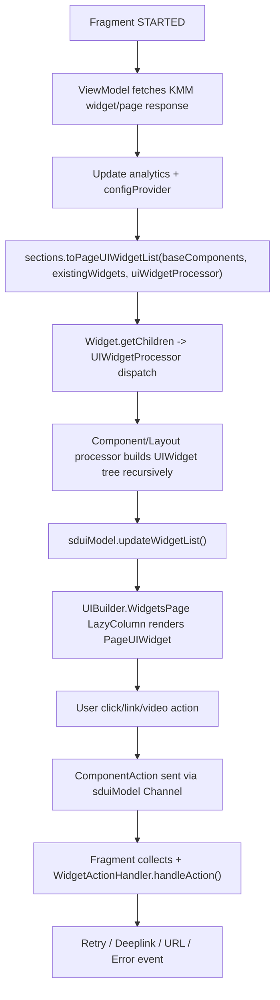

# Server-Driven UI (SDUI) Architecture

This document explains how SDUI is implemented in this project, from KMM/Felix response fetch to Compose rendering and user action handling.

Scope:
- `base/domain/sdui`
- Dashboard/page integrations in `readiness`, `callai`, and `equip`

## 1. High-Level Architecture

At runtime, SDUI is a pipeline with 4 stages:
1. Fetch dashboard/page/widget response from KMM model (`PageWidgetModel` / `DashboardWidgetModel`).
2. Convert server response (`Section`/`Widget`/`Component`) into a Compose widget tree (`PageUIWidget` / `UIWidget`).
3. Store tree + shared runtime state in `SDUIModel`.
4. Render via `UIBuilder` and route user actions via `ComponentAction` channel.

### Core design patterns

- Strategy pattern:
  - `UIWidgetProcessor` dispatches by `ComponentType` and `LayoutStyle` to dedicated processors.
- Composite pattern:
  - `UIWidget` is the render interface; layout widgets recursively contain child `UIWidget`s.
- Builder/adapter mapping:
  - Extension functions convert wire models into UI models:
    - `toPageUIWidgetList`
    - `toPageUIWidget`
    - `toUIWidgetList`
- State holder pattern:
  - `SDUIModel` centralizes UI runtime state (list states, refresh state, interaction source, action channel, webview/video/scroll state).
- Event-driven navigation:
  - components emit `ComponentAction`; fragment collects actions and resolves navigation via `WidgetActionHandler`.

## 2. Key Runtime Types

### 2.1 SDUIModel

`SDUIModel` (`SDUIModelImpl`) is the runtime contract for SDUI rendering.

It owns:
- page list/grid state:
  - `lazyListState`
  - `lazyGridState`
- `isRefreshingState`
- reactive widget list:
  - `SnapshotStateList<PageUIWidget>`
- shared configuration:
  - `ConfigProvider` (`pageConfig`, `sectionConfig`)
- interaction and action plumbing:
  - `Channel<ComponentAction>`
  - `MutableInteractionSource`
- feature-specific controllers:
  - `VideoController`
  - `ScrollStateController`
  - webview min-height map
- analytics provider

### 2.2 UIWidget and PageUIWidget

- `UIWidget` is the composable abstraction for both primitive components and composite layouts.
- `PageUIWidget` extends `UIWidget` for top-level page entries inside `LazyColumn`.
- `PageUIWidgetStack` is the main top-level widget container representing a server `Widget`.
- `PageDivider` and `SectionDivider` are injected separators.

### 2.3 UIWidgetProcessor

`UIWidgetProcessor` is the dispatcher:
- Component processors (primitive widgets):
  - `TextComponentProcessor`
  - `HTMLTextComponentProcessor`
  - `ProgressBarComponentProcessor`
  - `SpacerComponentProcessor`
  - `ImageComponentProcessor`
  - `IconFontComponentProcessor`
  - `GradientComponentProcessor`
  - `RichTextComponentProcessor`
  - `CustomWebViewComponentProcessor`
  - `VideoComponentProcessor`
  - `VideoWebComponentProcessor`
  - `SwitchComponentProcessor`
- Layout processors (composite widgets):
  - `GridLayoutProcessor`
  - `HorizontalListLayoutProcessor`
  - `HorizontalStackLayoutProcessor`
  - `PagerLayoutProcessor`
  - `VerticalListLayoutProcessor`
  - `VerticalStackLayoutProcessor`
  - `ZStackLayoutProcessor`

If a component/layout type is unsupported, dispatch returns `null` and the node is skipped.

## 3. End-to-End Flow

### 3.1 Fetch and state update

Typical screen flow (Readiness/CallAI/Equip/Program):
1. ViewModel calls KMM model with `WidgetDashboardRequest` or `WidgetAllContentRequest`.
2. Response is observed in a coroutine flow.
3. On success:
   - update analytics provider scheme from response analytics.
   - extract `sections`.
   - apply page/section config into `ConfigProvider`.
   - convert sections to `PageUIWidget` list.
   - call `sduiModel.updateWidgetList(widgetList)`.
4. UI updates automatically because `widgetList` is a Compose snapshot list.

### 3.2 Response to UI tree conversion

`List<Section>.toPageUIWidgetList(...)` does:
- iterate sections
- iterate section widgets
- convert each `Widget` into `PageUIWidgetStack`
- inject section/page dividers based on config
- preserve previous object references when values are equal (to reduce churn)

`Widget.toPageUIWidget(...)` does:
- map style (padding/background/corners/loading/error)
- compute child widgets using `Widget.getChildren(...)`

`Widget.getChildren(...)` does:
- iterate `mobileLayout.childrens` wrappers
- resolve referenced component from:
  1. local child components
  2. widget-level override maps
  3. `baseComponents`
- dispatch each node via `uiWidgetProcessor.getUIWidget(...)`

### 3.3 Recursive component/layout construction

`UIWidgetProcessor.getUIWidget(...)` algorithm:
1. resolve `item` at current index (for list/paged widgets)
2. check `ComponentType.of(componentWrapper.component)`:
   - if component type known -> component processor
   - else -> treat as layout using `component.layout.getType()` and layout processor
3. layout processors recursively call back into `UIWidgetProcessor` for children

This recursion builds the complete tree before Compose render.

### 3.4 Compose render

`UIBuilder.WidgetsPage(...)`:
- wraps page in pull-to-refresh + background + nested scroll interop
- renders `sduiModel.widgetList` via `LazyColumn`
- key: `it.key + it.isLoading`
- each `PageUIWidget.Compose(sduiModel)` renders subtree

`UIBuilder.WidgetsPageGrid(...)` is used by see-all/paging flow with `LazyGridUIWidget`.

### 3.5 Action flow

1. Components/layouts use `Modifier.applyAction(...)` (or direct send in widgets like `SwitchUIWidget`) to emit `ComponentAction` into `sduiModel.getComponentActionChannel()`.
2. Fragment collects channel with `receiveAsFlow()`, throttles clicks, and delegates to `WidgetActionHandler.handleAction(...)`.
3. `WidgetActionHandlerImpl` resolves:
   - retry actions (`retryModel.widgetId`)
   - app deeplinks
   - branch/page deeplinks
   - plain URLs
4. Fragment converts result to navigation or browser action.

## 4. Expected Server Response Contract (Practical)

KMM/Felix model classes are external dependencies; contract below is inferred from actual field usage in this code.

### 4.1 Top-level response (dashboard/page)

Expected fields used by app:
- `analytics`
- `pageConfig`
  - `backgroundColor`
  - `dividerHeight`
- `sectionConfig`
  - `backgroundColor`
  - `dividerBackgroundColor`
  - `dividerHeight`
  - `dividerPaddingLeft`
  - `dividerPaddingRight`
- `sections: List<Section>`
- base component pool (accessed via `getBaseComponentsMap()`)

### 4.2 Section

Used fields:
- `widgets: List<Widget>?`
- `config.showSeparator` (optional, defaults true)

### 4.3 Widget

Used fields:
- identity/state:
  - `id`, `name`, `uniqueId`, `isLoading`, `hasError`
- layout root:
  - `layout.component.mobileLayout.style`
  - `layout.component.mobileLayout.childrens`
  - `layout.component.childComponents`
- list/paged data:
  - `items`
- overrides:
  - `componentWidgetMap`
  - `componentWidgetWrapperMap`

### 4.4 ComponentWrapper

Used fields:
- `component` (component id/type reference)
- `value`
- `config.visibility`
- `action`
  - `navigationUrl`
  - `retryModel.widgetId`
  - `tracking`
- `style` including:
  - `padding`, `size`, `border`, `cornerRadius`, `backgroundColor`
  - `font`, `lineLimit`, `underline`, `layoutPriority`
  - `accentColor`, `fadingEdge`, `scaleMode`, `forceLayoutDirection`
  - list/grid-specific config via layout style
- `meta` (video thumbnail/title)

### 4.5 Component

Used fields:
- `id`
- `layout`
  - `style`
  - `childrens`
  - layout type

### 4.6 List item payload (`items[]`)

Used fields:
- `value`
- `componentMap` (per-item component override)
- `componentWrapperMap` (per-item wrapper override)

### 4.7 Example shape (illustrative)

```json
{
  "analytics": { "...": "..." },
  "pageConfig": { "backgroundColor": "#FFFFFF", "dividerHeight": 12 },
  "sectionConfig": {
    "backgroundColor": "#FFFFFF",
    "dividerBackgroundColor": "#EAEAEA",
    "dividerHeight": 1,
    "dividerPaddingLeft": 16,
    "dividerPaddingRight": 16
  },
  "sections": [
    {
      "config": { "showSeparator": true },
      "widgets": [
        {
          "id": "widget_1",
          "name": "Example",
          "uniqueId": "u_widget_1",
          "isLoading": false,
          "hasError": false,
          "layout": {
            "component": {
              "mobileLayout": {
                "style": {
                  "padding": { "left": 16, "right": 16, "top": 8, "bottom": 8 },
                  "backgroundColor": "#FFFFFF"
                },
                "childrens": [
                  { "component": "title_component", "value": "Hello", "style": { "lineLimit": 2 } }
                ]
              },
              "childComponents": [
                { "id": "title_component", "layout": { "...": "..." } }
              ]
            }
          },
          "items": [
            {
              "value": "Item value",
              "componentMap": {},
              "componentWrapperMap": {}
            }
          ],
          "componentWidgetMap": {},
          "componentWidgetWrapperMap": {}
        }
      ]
    }
  ]
}
```

## 5. Processor Resolution Rules

### 5.1 Component vs Layout routing

A node is treated as component if `ComponentType.of(componentWrapper.component)` resolves to known type; otherwise it is treated as layout using `component.layout.getType()`.

### 5.2 Override precedence (effective)

For child component + wrapper resolution in stack layouts:
1. per-item wrapper (`item.componentWrapperMap`)
2. widget-level wrapper (`widget.componentWidgetWrapperMap`)
3. declared wrapper

For component body:
1. local child component in widget tree
2. per-item component override (`item.componentMap`)
3. widget-level component override (`widget.componentWidgetMap`)
4. base component from `baseComponents`

## 6. Lifecycle Details

### 6.1 Screen lifecycle

- Fragment starts collectors in `launchWithRepeatOnLifecycle(STARTED)`:
  - compose content binding
  - component action flow collection
  - network connectivity refresh
- ViewModel controls loading/error/data view state and refresh intent state.

### 6.2 Composition lifecycle

- Top list is virtualized with `LazyColumn`.
- `PageUIWidgetStack` uses `animateContentSize()` and shimmer placeholder when loading.
- Recomposition source of truth:
  - `sduiModel.widgetList`
  - local widget remembered states (list expand/collapse, video play state, etc).

### 6.3 Nested interaction lifecycle

- Vertical list “show more” state is persisted in `ScrollStateController` by widget key + item count.
- Horizontal list scroll position is persisted by key (`LazyListState`).
- WebView min heights are cached in `SDUIModel` map by key.

### 6.4 Video lifecycle

`VideoUIWidget` and `FullScreenVideoDialog` handle:
- media player creation via `VideoController.mediaPlayerFactory`
- resume position persistence on stop/dispose
- fullscreen toggles via `MediaPlayerEvents.Fullscreen`
- device rotation via `DeviceScreenRotationHandler`
- error fallback UI (no internet/data)

### 6.5 WebView lifecycle

- `RichTextUIWidget` uses `MTWebView` with accompanist webview client.
- link clicks send `ComponentAction(navigationUrl=...)`.
- height measured via layout listener and persisted on dispose.
- long web content can open full-screen dialog (or deeplink via `WidgetSeeMoreActionHandler` for custom webview flow).

## 7. Performance Characteristics

### 7.1 What is already optimized

- Lazy rendering for page list (`LazyColumn`) and see-all (`LazyVerticalGrid` + Paging3).
- Stateful controllers preserve scroll/expand/video positions across recompositions.
- `updateWidgetList` performs index-based incremental update instead of full replace.
- Page conversion attempts reference reuse when old and new widgets are equal.
- Image loading uses Coil with explicit memory/disk cache keys (query removed).

### 7.2 Current hotspots / constraints

- Action channel is `Channel()` (rendezvous); `trySend` can drop actions if no active receiver.
- Some containers (e.g., `GridLayout`, stack/list child loops) eagerly compose all children in memory.
- `CustomWebViewUIWidget` reloads HTML in `AndroidView.update`, which can be expensive for frequent recompositions.
- `LazyGridUIWidget` uses a constant content type string for all items; less granular reuse.
- `PageUIWidgetStack.animateContentSize()` can be expensive with very deep/large trees.

### 7.3 Scaling guidance

For larger pages and heavier widgets:
- prefer list/paged layouts (`VerticalList`, `HorizontalList`, paging grid) for large collections.
- keep `uniqueId` stable across refreshes.
- keep top-level widget count moderate and split large sections.
- move expensive HTML/video blocks below initial fold when possible.
- ensure server payload only sends required wrappers/components (avoid oversized override maps).

## 8. Error Handling Behavior

- If no sections/widgets after response -> empty-state errors are shown and analytics no-data event is sent.
- If fetch fails:
  - when local widget list is empty -> blocking error state
  - when local list exists -> snackbar/non-blocking error
- Network reconnect triggers optional refresh from fragments.

## 9. Extending SDUI

### 9.1 Add a new component type

1. Create `NewComponentProcessor : ComponentProcessor`.
2. Create `NewUIWidget : UIWidget` for Compose rendering.
3. Register in `UIWidgetProcessor.componentProcessorMap`.
4. Ensure server sends compatible `ComponentType` + wrapper fields.
5. Validate action handling if component emits clicks/links.

### 9.2 Add a new layout type

1. Create `NewLayoutProcessor : LayoutProcessor`.
2. Create `NewLayoutUIWidget : UIWidget` that composes children.
3. Register in `UIWidgetProcessor.layoutProcessorMap`.
4. Keep child resolution logic consistent with existing precedence rules.

### 9.3 Add new action behavior

1. Ensure component emits `ComponentAction` fields.
2. Extend `WidgetActionHandlerImpl.handleAction(...)` mapping.
3. Handle resulting `WidgetActionEvent.Result` in fragments.

## 10. Sequence Diagram



## 11. Operational Checklist

When debugging SDUI issues:
1. Verify response contains non-empty `sections/widgets`.
2. Verify `componentWrapper.component` maps to supported component or layout type.
3. Verify `uniqueId` stability for diffing/state retention.
4. Check action events are received in fragment collector.
5. Check style fields (`size`, `padding`, `visibility`) are valid and not hiding nodes.
6. For web/video issues, validate URL/value and lifecycle transitions (pause/stop/fullscreen).

---

If needed, this document can be split further into:
- `docs/sdui-response-contract.md`
- `docs/sdui-extension-guide.md`
- `docs/sdui-performance-playbook.md`
